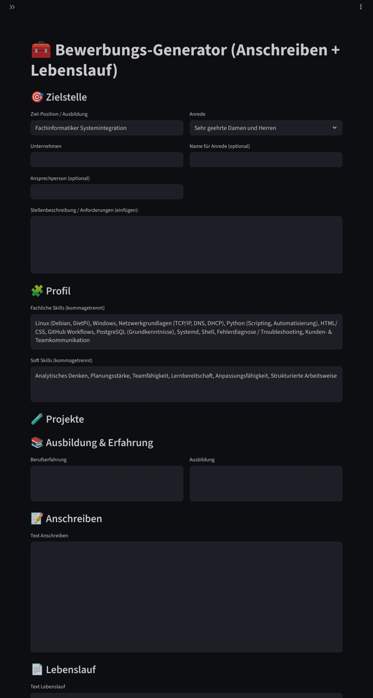

# 📑 Bewerbungs-Generator (Private WebApp)

## Überblick
Dieses Projekt ist ein **selbst entwickeltes Webtool**, das die **Erstellung von Bewerbungsunterlagen** automatisiert und gleichzeitig individuelle Anpassungen ermöglicht.  
Die Anwendung besteht aus einer **Streamlit-WebApp**, die im lokalen Netzwerk läuft, sowie einer **Android WebView-App**, die einen komfortablen mobilen Zugriff bietet.  

👉 **Hinweis:**  
Der Quellcode bleibt privat, um persönliche Daten zu schützen. Hier findest du daher nur **Screenshots**, eine Projektbeschreibung und die eingesetzten Technologien.

---

## ✨ Features
- **Anschreiben-Generator**  
  Automatisierte Erstellung eines individuellen Anschreibens anhand einer Stellenbeschreibung.  

- **Lebenslauf-Editor**  
  Interaktive Eingabemaske zur Pflege von Lebenslaufdaten (Ausbildung, Berufserfahrung, Skills etc.).  

- **PDF/DOCX Export**  
  Mit einem Klick können Anschreiben und Lebenslauf als PDF oder Word-Dokument exportiert werden.  

- **Anpassbare Vorlagen**  
  Moderne, klar strukturierte Layouts – geeignet für IT-Berufe wie z. B. Fachinformatiker Systemintegration.  

- **Mobile App (Android)**  
  Eine WebView-basierte APK ermöglicht den Zugriff direkt vom Smartphone, ohne den Browser öffnen zu müssen.  

---

## 🛠️ Technologien
- **Backend/WebApp:** [Streamlit](https://streamlit.io/) (Python)  
- **PDF/DOCX Export:** `fpdf2`, `python-docx`  
- **Deployment:** Debian Server, `systemd`-Service  
- **Mobile Client:** Android (WebView-Wrapper in Kotlin/Java)  

---

## 📸 Screenshots
*(Beispielbilder mit Dummy-Daten einfügen)*

| Startseite | Bewerbungseditor | Export |
|------------|------------------|--------|
|  |  |  |

---

## 🚀 Nutzung
- Die WebApp läuft **lokal im internen Netzwerk** (kein öffentlicher Zugriff).  
# 📑 Bewerbungs-Generator (Private WebApp)

## Überblick
Dieses Projekt ist ein **selbst entwickeltes Webtool**, das die **Erstellung von Bewerbungsunterlagen** automatisiert und gleichzeitig individuelle Anpassungen ermöglicht.  
Die Anwendung besteht aus einer **Streamlit-WebApp**, die im lokalen Netzwerk läuft, sowie einer **Android WebView-App**, die einen komfortablen mobilen Zugriff bietet.  

👉 **Hinweis:**  
Der Quellcode bleibt privat, um persönliche Daten zu schützen. Hier findest du daher nur **Screenshots**, eine Projektbeschreibung und die eingesetzten Technologien.

---

## ✨ Features
- **Anschreiben-Generator**  
- **Lebenslauf-Editor**  
- **PDF/DOCX Export**  
- **Anpassbare Vorlagen**  
- **Mobile App (Android)**  

---

## 🛠️ Technologien
- **Backend/WebApp:** [Streamlit](https://streamlit.io/) (Python)  
- **PDF/DOCX Export:** `fpdf2`, `python-docx`  
- **Deployment:** Debian Server, `systemd`  
- **Mobile Client:** Android (WebView-Wrapper)  

---

## 📸 Screenshot
*(Beispiel mit Dummy-Daten / Startansicht der App)*  

---

## 🚀 Nutzung
- Die WebApp läuft **lokal im internen Netzwerk** (kein öffentlicher Zugriff).  
- Der Android-Client greift über eine feste IP (`http://192.168.x.x:8501`) darauf zu.  
- Quellcode wird nicht veröffentlicht, Projekt dient als **Proof of Concept** und **Portfolio-Referenz**.  

---

## 📂 Projektstatus
✅ Funktional im internen Einsatz  
🔒 Quellcode privat (nicht veröffentlicht)  
🖼 Screenshot & Dokumentation dienen als Showcasenshots & Dokumentation dienen als Showcase  
